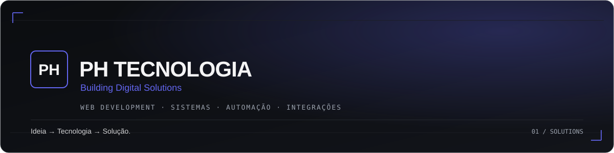

Se existe um problema que pode ser resolvido com tecnologia, a gente encontra
um jeito de construir a solução.

---

### `WEB DEVELOPMENT` · `SISTEMAS` · `AUTOMAÇÃO` · `INTEGRAÇÕES`

Sites e sistemas sob medida pra pequenos e médios negócios — do primeiro
rascunho ao produto no ar. Sem intermediário: você fala direto com quem
desenvolve.

Não fazemos "template genérico com nome trocado". Cada entrega é pensada pro
negócio que vai usar — funcional, rápida, e com identidade visual própria.

---

### Stack

---

### Como trabalhamos

`01` Você conta o problema, sem precisar saber o termo técnico certo
`02` A gente traduz isso em solução — site, sistema, automação ou integração
`03` Você acompanha o processo de perto, com comunicação direta

---

*Direct communication. Better solutions.*

